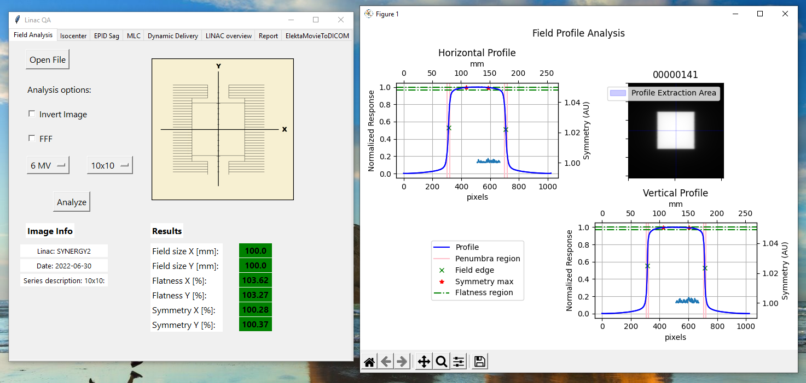
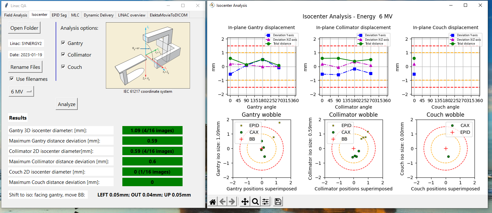
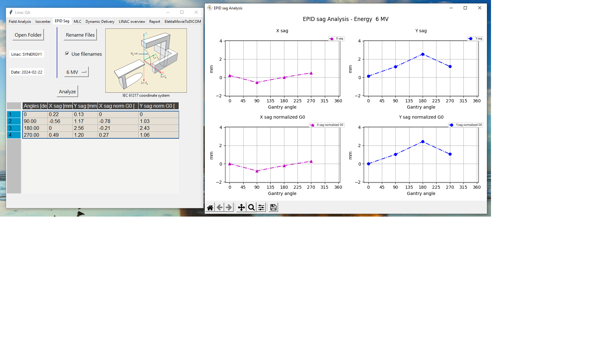
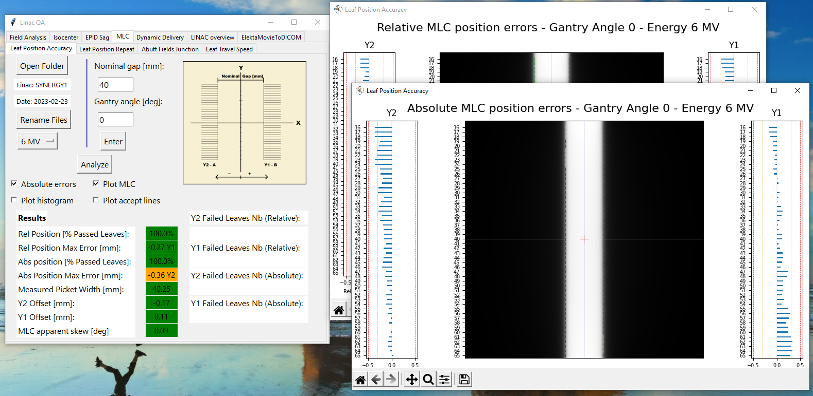
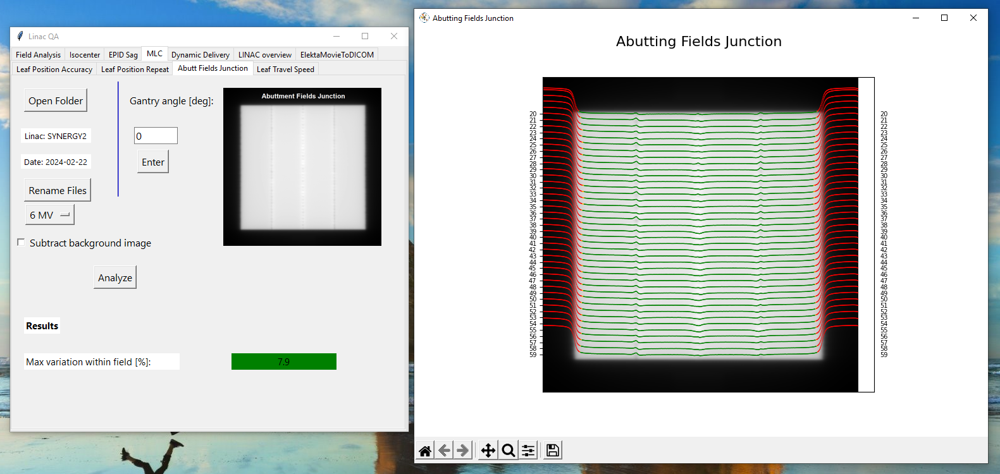
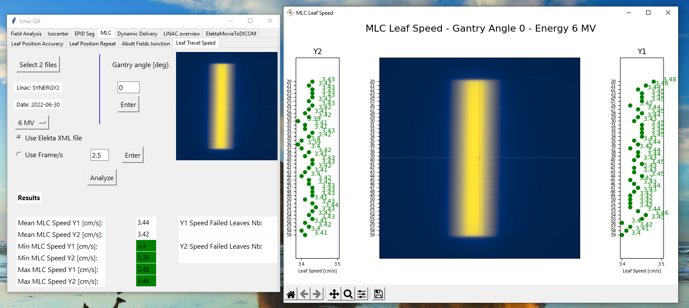
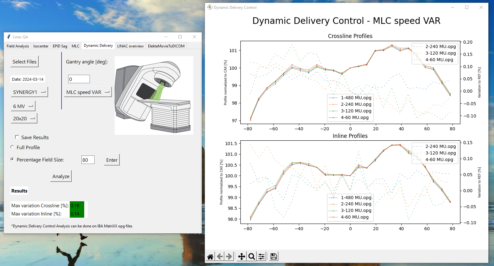
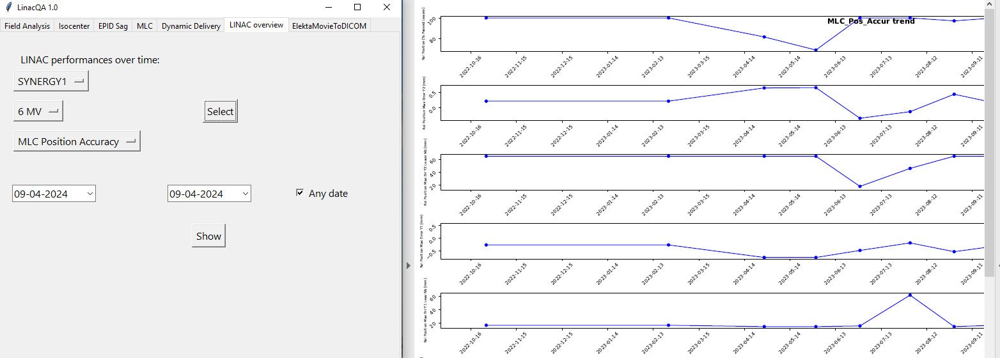
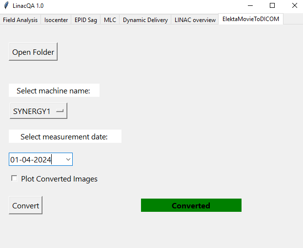

<h1>LinacQA Software</h1>

## Table of contents:
1. [Introduction](#introduction) 
2. [Installation and settings](#installation) 
3. [Citation and distribution](#citationanddistribution) 
4. [Software Tabs](#softwaretabs): 

    4.1 [Field Analysis](#fieldanalysis-1) 
    4.2 [Isocenter](#isocenter-2) 
    4.3 [EPID Sag](#epidsag-3) 
    4.4 [MLC](#MLC-4) 
    - 4.4.1 [Leaf Position Accuracy](#leafpositionaccuracy-41) 
    - 4.4.2 [Leaf Position Repeatibility](#leafpositionrepeat-42) 
    - 4.4.3 [Abuttment Fields Junction](#abuttmentfieldsjuction-43) 
    - 4.4.4 [Leaf Travel Speed](#leaftravelspeed-44) 
    
    4.5 [Dynamic Delivery](#dynamicdelivery-5) 
    4.6 [LINAC Overview](#linacoverview-6) 
    4.7 [Elekta Movie to DICOM conversion](#elektamovietodicom-7) 
5. [References](#references) 
6. [Contacts](#contacts) 

# <a id="introduction"> 1.Introduction </a>

LinacQA is a software for evaluating several AAPM reports (1)(2)(3) parameters from EPID images, based on the free python package Pylinac (4)(5). The software has a user friendly GUI and can be run from Windows computers, without the need of any installation. Acceptance criteria and machine specifications can be set in configuration files. Results are automatically stored in excel files, to be easily accessible outside the software. 
 
The program performs different analysis: 
- The first tab evaluates field size, flatness and symmetry (consistency check for test 2.D.1.14(2)); 
- The second tab analyses Winston-Lutz (WL) images to assess gantry, collimator and couch isocenter sizes and the coincidence between mechanical/radiation or CBCT/radiation isocenters (tests 2.D.2(2), in particular 2.D.2.1(2), 2.D.2.2(2), 2.D.2.3(2) and 2.D.2.5(2). It can be used for 2.F.3.3(2) as well; or tests M11(3) and MLC4(3); 
- The third tab calculates EPID sag; 
- The fourth tab assesses MLCs performances: leaf position accuracy (tests 2.F.2.1(2), 2.F.2.2(2), 2.F.2.4(2) or test MLC2(3)) and repeatability (2.F.3.2(2)), abutting fields junctions (2.F.1.1(2)), leaf travel speed (2.F.2.3(2)); 
- The fifth tab can perform Dynamic Delivery control (DDC) tests D5(3). To evaluate DCC we used an IBA Matrixx detector. 
- LINAC performances over time are shown in the sixth tab. 
- The last tab converts Elekta Movie format to a DICOM series to be able to evaluate Leaf Travel Speed; 

# <a id="installation"> 2.Installation and settings </a>

The LinacQA.exe file can be run on any Windows computer without the need of installation. 
 
The following files must be in the same folder as the executable: 
- settings_file.csv 
- acceptance_criteria.csv 
- fields_delivery_order_junction.csv 
- fields_delivery_order_MLC.csv 
- fields_delivery_order_speed.csv 
- fields_delivery_order_WL.csv 

The images must be in the **images** folder where the executable is: 

- AbuttmentFieldsJunction.png 
- DDC.png 
- FieldAnalysis.png 
- IEC61217.png 
- LeafPositionAccuracy.png 
- LeafTravelSpeed.png 

The LinacQA.py file runs on Python version 3.8.13. 
All packages required are listed in: 

    requirements_linacQA.txt
    
The project is stored in: 

    https://github.com/glomio/LinacQA-Software
***
The **settings_file.csv** file defines the machine specific settings needed for the analysis, together with the default parameters values. 
        **save_file_name** defines the excel file where storing the results. An excel file for each machine will be automatically created by running the first analysis. The complete filename for each machine is save_file_name underscore machine_name. The machine name is read from the analyzed DICOM file: DICOM TAG (0008,1010) and compared to the **machine_list**. Make sure the Station Name DICOM tag includes the machine name as specified in machine_list 
        Results are automatically saved in the above mentioned file each time an analysis is run except for the Dynamic Delivery tab, where the user can select or deselect the automatic saving. 
        **energy_options** is the list of machines supported energies. 
        **field_size_options** is the list of possible open fields size analysis in the Field Analysis and Dynamic Delivery tabs. 
        **MLC_arrangement** describes the LINAC MLC details, specifying the number of leaves and leaves width. It reads tuples of values. 
        **MLC_nominal_speed** describes the vendor defined nominal leaves speed. 
        **DDC_analysis_list** describes the names of dynamic delivery control tests run on the DDC tab. This names are used for correctly saving results. 
        **machineSAD** defines the SAD, while **imageSID** defines the EPID SID. **imagepixelspacing** defines the Image Pixel Spacing DICOM tag of the Elekta movie format. These last 3 settings are used for correctly converting Elekta Movie format into a DICOM series. 
        Defalut values appearing the the GUI are as well set in this file (see specific tabs). 
 
***
The **acceptance_criterias.csv** file defines the acceptance criterias for all LinacQA tests. 
**att_lev** and **act_lev** are the attention and action levels respectively. They should be set according to the acceptance criterias defined by the hospital Medical Physics team. The values entered in the uploaded example shouldn't be taken as a reference, every center should define their specific acceptance criterias. 
***
**fields_deliver_order** files describes the beam delivery order for a specific test. It is needed to correctly rename DICOM images before analysis.They must be adjusted accordingly to the actual beams delivered. Each file is further described in the the specific test section of this document. 

# <a id="citationanddistribution"> 3. Citation and distribution </a>

G. Miori, M. Chieregato, C. Rancan, M. Galelli. PD-01.44 - DEVELOPMENT AND VALIDATION OF AN EPID BASED SOFTWARE FOR LINAC QA BUILT ON A FREE PYTHON PACKAGE,Physica Medica, Volume 115, Supplement 1,2023,103018, 
https://doi.org/10.1016/j.ejmp.2023.103018.
 
# <a id="softwaretabs"> 4. Software Tabs </a>

## <a id="fieldanalysis-1"> 4.1 Field Analysis </a>

The field analysis tab evaluate Field size, Flatness and Symmetry of open fields. Flatness and Symmetry has the Elekta definition. 
This tab can be used to perform a quick and frequent consistency check of AAPM TG198 test 2.D.1.1. 
In the **acceptance_criterias** file, **field_size_acc**, **fla_acc** and **sym_acc** parameters must be defined as acceptance criterias for field size accuracy, flatness and symmetry respectively. 
In **Open file** select one DICOM image to analyse. 
**Invert image** should be used in case the algorithm has difficulties in identifying the field (typically for large field size). The software pops up a warning in case this checkbox should be selected/deselected 
Select **FFF** for FFF images (Flatness is not computed). 
Select energy and image nominal field size in the scroll down menus to correctly save the results. 
**Image info** displays: 
- Station Name as in the DICOM TAG (0008,1010) - compared to the **machine_list**. 
- Date as in the DICOM TAG (0008,0020) 
- Series Description as in the DICOM TAG (0008,103E) 

Press **Analyze** to run the test. 
Results are automatically stored in the correct linac excel file in the **Field_Analysis** spreadsheet. Analysis figures are not automatically stored and must be manually saved by the **Save the figure** button, if wanted. 

## <a id="isocenter-2"> 4.2 Isocenter </a>

Isocenter tab runs a Winston-Lutz (WL) test on acquired DICOM images. 
This tab can be used to evaluate AAPM TG198 tests 2.D.2, in particular 2.D.2.1, 2.D.2.2, 2.D.2.3 and 2.D.2.5. It can be used for 2.F.3.3 test by selecting the appropriate delivery beams. 
In the **acceptance_criterias** file, **G3Diso_acc** parameter must be defined as the acceptance criteria for Gantry 3D isocenter diameter, while  **iso2D_acc** as the acceptance criteria for all other results. 
In **Open Folder** select the folder with WL acquired DICOM images.
The following information are printed: 
- Station Name as in the DICOM TAG (0008,1010) - compared to the **machine_list**. 
- Date as in the DICOM TAG (0008,0020) 

By clicking **Rename Files** the files in the selected folder are renamed based on the **fields_deliver_order_WL** list. **fields_deliver_order_WL** is the list of beam delivered with specific gantry, collimator and couch angles used, as in the example. The name syntax is mandatory for the software to run the test with **Use filenames**. 
Select the **Analysis options** you want to run and choose the energy in the scroll down menu to correctly save the results. 
Press **Analyze** to run the test. 
Summary results displayed in the GUI are automatically stored in the correct linac excel file in the **ISO_Analysis** spreadsheet, while deviations for each image are saved in the **ISO_dev_GANTRY**, **ISO_dev_COLLIMATOR** or **ISO_dev_COUCH** spreadsheet for each energy. Analysis figures are not automatically stored and must be manually saved by the **Save the figure** button, if wanted. 

## <a id="epidsag-3"> 4.3 EPID Sag </a>

Isocenter tab runs a Winston-Lutz (WL) test on acquired DICOM images showing results for EPID sag in X and Y as a function of gantry angle. The test calculates X and Y EPID sag and X and Y EPID sag normalized to the gantry 0 image.  
No acceptance criterias are defined for the EPID sag analysis. 
In **Open Folder** select the folder with WL acquired DICOM images.
The following information are printed: 
- Station Name as in the DICOM TAG (0008,1010) - compared to the **machine_list**. 
- Date as in the DICOM TAG (0008,0020) 

By clicking **Rename Files** the files in the selected folder are renamed based on the **fields_deliver_order_WL** list. **fields_deliver_order_WL** is the list of beam delivered with specific gantry, collimator and couch angles used, as in the example. The name syntax is mandatory for the software to run the test with **Use filenames**. 
Press **Analyze** to run the test. 
Results are saved in the correct linac excel file in the **EPID_sag** spreadsheet. Analysis figures are not automatically stored and must be manually saved by the **Save the figure** button, if wanted. 

## <a id="MLC-4"> 4.4 MLC </a>

The MLC tab runs several AAPM TG 142/198 tests to evaluate MLCs performances.  In particular, we refer to AAPM TG198 2.F tests on MLCs. 

## <a id="leafpositionaccuracy-41"> 4.4.1 Leaf Position Accuracy </a>

Leaf Position Accuracy test analyses both relative and absolute MLC position errors; 
For the MLCs analysis, we modified the Pylinac algorithm to calculate absolute leaves positions (as recommended by TG-142) and single leaf error analysis. Absolute leaves positions are calculated from the radiation field center, identified by the use of 4 additional small square fields images at different collimator positions. Relative leaves positions to the median leaves position are also performed. 
This tab can be used to evaluate AAPM TG198 2.F.2.1, 2.F.2.2, 2.F.2.4 tests on MLCs or test MLC2(3). 
 
In the **acceptance_criterias** file, MLC_rel_pos_perc_failed, MLC_rel_pos_max_error refers to relative position errors acceptance criterias, while MLC_abs_pos_perc_failed and MLC_abs_pos_max_error refers to absolute position errors. MLC_abs_banks_offset is the acceptance criteria for Y2 Offset and Y1 Offset in the GUI, while MLC_mean_picket_width_acc is the acceptance criteria for Measured Picket Width. MLC_skew is the acceptance criteria for MLC apparent skew in the GUI. 
In **Open Folder** select the folder with MLC acquired DICOM images and the 4 additional small square fields images, if absolute error analysis is done. It is important to start delivering the MLC beams being sure gantry and collimator angle = 0.00 degrees. Deliver the 4 small square fields images with different collimator positions at the end of the test. 
The following information are printed: 
- Station Name as in the DICOM TAG (0008,1010) - compared to the **machine_list**. 
- Date as in the DICOM TAG (0008,0020) 

By clicking **Rename Files** the files in the selected folder are renamed based on the **fields_deliver_order_MLC** list. **fields_deliver_order_MLC** is the list of beam delivered, at least one file including the word MLC must be saved for MLC analsysis. Absolute error analysis requires the 4 additional square fields images named *isoC_*, where *_* is the collimator angle.The name syntax is mandatory to run the test. 
Enter the correct *Nominal gap* and *Gantry angle* used for the measurement if different from the default ones. The default *Nominal gap* value in the GUI is set on the *default_value_nominal_gap* in the *settings_file*. 
Select the analysis and display options you want to run and choose the energy in the scroll down menu to correctly save the results. 
Press **Analyze** to run the test. 
Summary results displayed in the GUI are automatically stored in the correct linac excel file in the **MLC_Pos_Acc** spreadsheet, while deviations for each MLC leaf are saved in the **MLC_Pos_errors** spreadsheet for each energy. Analysis figures are not automatically stored and must be manually saved by the **Save the figure** button, if wanted. 

## <a id="leafpositionrepeat-42"> 4.4.2 Leaf Position Repeatibility </a>

Leaf Position Repeatibility tab can be used to evaluate AAPM TG198 2.F.3.2 test. 
MLC images should be taken by positioning/moving/repositioning the MLCs acquisition of the previous test. A single beam delivery can be used for both Leaf Position Accuracy and Leaf Position Repeatibility. 
Relative leaves positions is calculated as in the previous tab for each MLC image, and leaf by leaf difference within images is performed. 
In the **acceptance_criterias** file, MLC_repeat_err refers to different images position errors acceptance criterias, while MLC_repeat_perc_failed is the percentage of leaves that can fail.  
In **Open Folder** select the folder with MLC acquired DICOM images. At least 2 files including the word MLC must be saved in the selected folder. 
The following information are printed: 
- Station Name as in the DICOM TAG (0008,1010) - compared to the **machine_list**. 
- Date as in the DICOM TAG (0008,0020) 

Enter the correct *Gantry angle* used for the measurements if different from the default one, and choose the energy in the scroll down menu to correctly save the results. 
Press **Analyze** to run the test. 
Summary results displayed in the GUI are automatically stored in the correct linac excel file in the **MLC_Pos_Repeat** spreadsheet, while deviations for each MLC leaf are saved in the **MLC_Rep_errors** spreadsheet for each energy. Analysis figures are not automatically stored and must be manually saved by the **Save the figure** button, if wanted. 

## <a id="abuttmentfieldsjuction-43"> 4.4.3 Abuttment Fields Junction </a>

Abuttment Fields Junction tab can be used to evaluate AAPM TG198 2.F.1.1 test. 
It analyses field junctions and evaluates the percentage dose difference at junctions compared to the homogenous surrounding dose. It gives information on leaf tips match. 
Different MLC images should be taken in such a way that the MLC tips of one bank match the position of the MLC in the previous image. One image per MLC position should be acquired and ideally the images sum should be a flat profile. 
A background image can be used to normalize the picket and fence pattern. 
Field matching images are sum and the result image is analysed. 
In the **acceptance_criterias** file, MLC_abutt_junction_perc refers to the percentage dose difference acceptance criteria at the junction, in our test setting we saw that a 9% difference corresponds to ~ 0.5 mm displacement at the junction. 
In **Open Folder** select the folder with junctionimages. 
The following information are printed: 
- Station Name as in the DICOM TAG (0008,1010) - compared to the **machine_list**. 
- Date as in the DICOM TAG (0008,0020) 

By clicking **Rename Files** the files in the selected folder are renamed based on the **fields_deliver_order_junction** list. **fields_deliver_order_junction** is the list of beam delivered. The field junction files name must include the word "junction" and an increasing number, if using the background normalization, a file including the word "background" is needed. 
Enter the correct *Gantry angle* used for the measurements if different from the default one, and choose the energy in the scroll down menu to correctly save the results. If using background normalization select the "Subtract background image" checkbox.  
Press **Analyze** to run the test. 
Summary results displayed in the GUI are automatically stored in the correct linac excel file in the **MLC_Abutt_fields_junctions** spreadsheet. Analysis figures are not automatically stored and must be manually saved by the **Save the figure** button, if wanted. 

## <a id="leaftravelspeed-44"> 4.4.4 Leaf Travel Speed </a>

Leaf Travel Speed tab can be used to evaluate AAPM TG198 2.F.2.3 test. 
Leaf travel speed images should be sequential DICOM images acquired in EPID movie mode. For Elekta movie format, the files must be first converted by using the *ElektaMovieToDICOM* tab. After the conversion, the analysis can be done by considering the exact image timing stored in the Elekta XML file or by entering a Frame/s value. The default *Frame/s* value in the GUI is set on the *default_value_framexs* in the settings_file. 

In the **acceptance_criterias** file, **MLC_speed** defines the accepted deviation from the nominal MLC speed value. 
In **Select 2 files** select 2 DICOM images from converted movie EPID files. Two consecutives or non-consecutives frames can be analysed if using the Elekta XML file, otherwise only 2 consecutive frames can be analysed. 
The following information are printed: 
- Station Name as in the DICOM TAG (0008,1010) - compared to the **machine_list**. 
- Date as in the DICOM TAG (0008,0020) 

Enter the correct *Gantry angle* used for the measurements if different from the default one, and choose the energy in the scroll down menu to correctly save the results. 
Choose if using Elekta Movie XML file or Frame/s. Enter the correct *Frame/s* if different from the default one. 
Press **Analyze** to run the test. 
Summary results displayed in the GUI are automatically stored in the correct linac excel file in the **MLC_Leaf_Speed** spreadsheet, while leaf travel speed for each MLC are saved in the **MLC_Leaf_Speed_all_leaves** spreadsheet. Analysis figures are not automatically stored and must be manually saved by the **Save the figure** button, if wanted. 

## <a id="dynamicdelivery-5"> 4.5 Dynamic Delivery </a>

LINAC QA recommendations were updated in 2023 to emphasize the importance of testing DDC components, tests D5(3). Dynamic Delivery tab can be used to test DDC parameters by designing different dynamic fields and varying each parameter individually. In particular, you can compare profiles of the same dynamic field by varying leaf speed only, dose-rate only, gantry speed only or a combination of them. Beams can be obtained by increasing MUs (MU linearity must be tested separately). 
Dynamic Delivery tab works on IBA MatriXX opg files. 
 
In the **acceptance_criterias** file, **DDC** defines the maximum accepted variation value between profiles measured at different dynamic parameters. 
In **Select Files** , select 2 or more .opg files. The profiles are normalized to the central axes value of the first file in alphabetical order. You should rename the files so that the first one in the folder is the reference one. 
The following information are printed: 
- Date as in the .opg Date/Time row 

Choose machine name, energy, nominal field size and the dynamic delivery control test name in the scroll down menus to correctly save the results. Enter the correct *Gantry angle* used for the measurements if different from the default one. 
Select the **Save Results** checkbox if you want the results to be saved. Choose if considering the Full Profile or a Percentage of the nominal field size. The default *Percentage Field Size* value in the GUI is set on the *default_value_exclude_penumbra* in the *settings_file*. 

Press **Analyze** to run the test. 
Summary results displayed in the GUI are automatically stored in the correct linac excel file in the **Dynamic_Delivery_Control** spreadsheet. Analysis figures are not automatically stored and must be manually saved by the **Save the figure** button, if wanted. 

## <a id="linacoverview-6"> 4.6 LINAC Overview </a>

LINAC overview tab shows LINAC performances over time. It retrieves information from the excel files where analysed data are automatically stored.  
Select machine name, energy and analysis type, then click **Select**. 
Select dates interval or any date checkbox, then click **Show**. 
A pdf file showing LINAC performaces over time for a specific analysis is printed. The file is automatically saved as *trend_plot.pdf* file. 

## <a id="elektamovietodicom-7"> 4.7 Elekta Movie to DICOM conversion </a>

The tab converts Elekta Movie format files to a DICOM Images series. Elekta Movie format files are exported from iView database. 
In **Open Folder** select the folder where Elekta Movie EPID files are stores together with the Elekta *_Frame* XML file. 
Select machine name and measurement date, this information is added in the converted DICOM files. 
Click **Convert** to convert files. If the conversion is successful, a green box **Converted** appears.
If **Plot Converted Images** is selected, each DICOM converted frame is shown. 

# <a id="references"> 5. References </a>

(1) (Klein et al., E. E., (2009). Report No. 142 - Task Group 142 report: Quality assurance of medical accelerators. Medical Physics) 
(2) (Hanley et al.,J., (2021). Report No. 198 - AAPM Task Group 198 Report: An implementation guide for TG 142 quality assurance of medical accelerators. Medical Physics) 
(3) (Krauss et al.,R. F., (2023). AAPM Medical Physics Practice Guideline 8.b: Linear accelerator performance tests. Journal of Applied Clinical Medical Physics) 
(4) github.com/jrkerns/pylinac 
(5) (Kerns, J. R., (2023). Pylinac: Image analysis for routine quality assurance in radiotherapy. Journal of Open Source Software, 8(92), 6001)

# <a id="contacts"> 6. Contacts </a>
gloria.miori@gmail.com

=======
